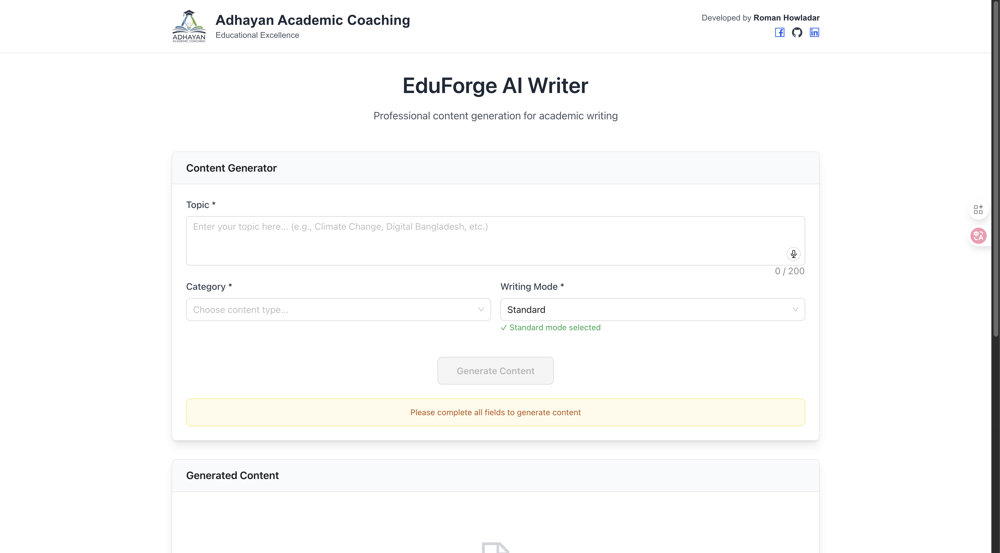

# 🚀 EduForge AI

## AI-Powered Content Generation for Students

EduForge AI is an intelligent writing assistant designed specifically for Bangladeshi students. It helps users generate high-quality educational content in various formats with just a few clicks.

**Live Demo:** [https://eduforge-ai.vercel.app/](https://eduforge-ai.vercel.app/)



## ✨ Features

- **Multiple Content Types** - Essays, paragraphs, dialogues, applications, reports, emails, stories, and notices
- **Voice Input** - Dictate your topics using speech recognition
- **Professional PDF Export** - Download your content as beautifully formatted PDFs
- **Mobile-Friendly Design** - Works perfectly on all devices
- **Easy Content Sharing** - Copy to clipboard with a single click

## 🛠️ Technical Stack

- **Frontend:** React, Next.js 14, TypeScript
- **UI Framework:** Ant Design, Tailwind CSS
- **AI Integration:** Google Gemini API
- **Deployment:** Vercel

## 🚀 Getting Started

### Prerequisites

- Node.js 18+
- npm or yarn
- Google Gemini API key

### Installation

1. Clone the repository

   ```bash
   git clone https://github.com/roman0190/eduforge-ai.git
   cd eduforge-ai
   ```

1. Install dependencies

   ```bash
   npm install
   # or
   yarn install
   ```

1. Create a `.env` file in the root directory with your API key

   ```plaintext
   NEXT_PUBLIC_GEMINI_API_KEY=your_api_key_here
   ```

1. Start the development server

   ```bash
   npm run dev
   # or
   yarn dev
   ```5. Open [http://localhost:3000](http://localhost:3000) in your browser

## 📚 Usage Guide

1. **Select Content Type** - Choose from essay, paragraph, dialogue, etc.
2. **Choose Writing Style** - Select from various writing modes
3. **Enter Topic** - Type or use voice input to specify your topic
4. **Generate Content** - Click "Generate Content" and wait for the AI
5. **Review & Export** - Copy the text or download as PDF

## 🌟 Content Types

| Type       | Features                          |
|------------|-----------------------------------|
| **Essay**  | Minimum 600 words, well-structured |
| **Paragraph** | 200-300 words, single paragraph  |
| **Dialogue** | Conversation between characters   |
| **Report** | Formal structure with headers      |
| **Application** | Formal request format          |
| **Email**  | Professional email structure       |
| **Story**  | Narrative with plot development    |
| **Notice** | Official announcement format       |

## 🔧 Customization

You can modify the content generation prompts in:

```typescript
/app/write-here/utils/geminiAPI.ts
```

UI components can be found in:

```typescript
/app/write-here/components/
```

## 🧠 How It Works

1. User inputs are collected and validated
2. A structured JSON prompt is sent to the Gemini API
3. The response is processed and displayed to the user
4. Users can export content in various formats

## 🔒 Privacy & Data

- No user data is stored on servers
- Content generation happens via secure API calls
- PDF generation is performed client-side

## 📱 Mobile Features

- Responsive design works on all screen sizes
- Voice input for easier mobile interaction
- Touch-optimized controls
- Efficient data usage

## 🚦 Limitations

- Requires internet connection
- API has usage limits
- Content should be reviewed for accuracy

## 👨‍💻 Contributors

- Roman Howladar - Lead Developer

## 📄 License

This project is licensed under the MIT License - see the LICENSE file for details.

## 🙏 Acknowledgements

- Google for providing the Gemini API
- Vercel for hosting
- All open-source libraries used in this project
